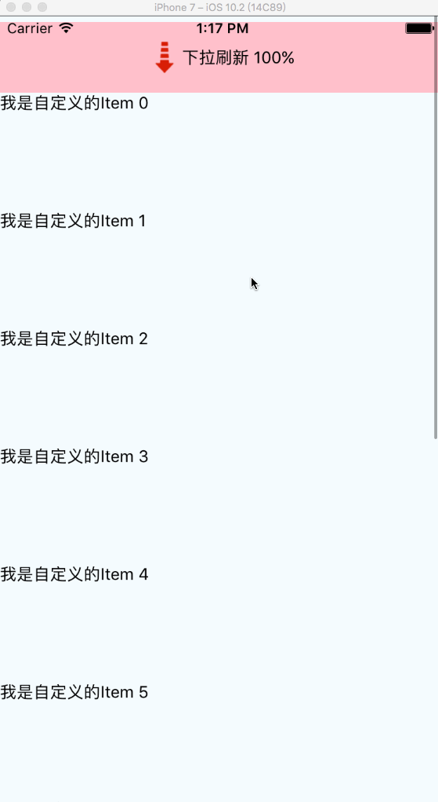

## RefreshFlatList & RefreshVirtualizedList
[](https://www.npmjs.com/package/react-native-refreshflatlist)
[](https://www.npmjs.com/package/react-native-refreshflatlist)
[](https://www.npmjs.com/package/react-native-refreshflatlist)

> A simple support ios and android platform custom header refresh components; currently only supports FlatList (RN >= 0.43)


```
npm i react-native-refreshflatlist --save
react-native link react-native-refreshflatlist
```

### Preview

* ScreenShot


<br>


* ViewType

```
// ScrollView
_renderItem = () => {
	return (
	  <View style={{width: width, height: 100}} >
	    <Text>{'Customer ScrollView'} </Text>
	  </View>
	)
}

// ListView
_renderItem = ({item}) => {
    return (
      <View style={{width: width, height: 100}} >
        <Text>{'Customer ListVeiw' + item.title} </Text>
      </View>
    )
  }
```

### Demo


```
git clone https://github.com/naivehhr/react-native-refreshflatlist.git
cd react-native-refreshflatlist/example && npm install

```

### Usage

```
export default class FlatListTest extends Component {
  constructor() {
    super()
    this.state = {
      headerHeight: 100,
      refreshing: false,
      _data: [],
      footerMsg: ''
    }
  }
  componentDidMount() {
    this.setState({_data: [1,2,3,4]})
  }

  _onRefreshFun = () => {
    this.setState({refreshing: true})
    setTimeout(() => {
      this.setState({refreshing: false})
    },2000)
  }

  _renderItem = ({item}) => {
    // ListView Item
    return (
      <View style={{width: width, height: 100}} >
        <Text>{'list item' + item.title} </Text>
      </View>
    )
  }
  
  
	/**
    * refreshState: 0: pullToRefresh; 1: releaseToRefresh; 2: refreshing; 3: refreshdown
    * percent:
    */
  _customerHeader = (refreshState, percent) => {
    const { headerHeight, msg } = this.state
    switch (refreshState) {
      case RefreshState.pullToRefresh:
        return (
          <Animated.View style={{justifyContent: 'center', alignItems: 'center', width: width, height: headerHeight, backgroundColor: 'red'}} >
            <Text>{ 'pull to refresh' + percent }</Text>
          </Animated.View>
        )
      case RefreshState.releaseToRefresh:
        return (talk
          <Animated.View style={{justifyContent: 'center', alignItems: 'center', width: width, height: headerHeight, backgroundColor: 'red'}} >
            <Text>{ 'release to refresh' + percent }</Text>
          </Animated.View>
        )
      case RefreshState.refreshing:
        return (
          <Animated.View style={{justifyContent: 'center', alignItems: 'center', width: width, height: headerHeight, backgroundColor: 'red'}} >
            <Text>{ 'refreshing....' + percent }</Text>
          </Animated.View>
        )
      case RefreshState.refreshdown:
        return (
          <Animated.View style={{ flexDirection: 'row',height: headerHeight, justifyContent: 'center', alignItems: 'center', backgroundColor: 'red',}}>
            <Text>{ 'refresh complete' }</Text>
          </Animated.View>
        )
      default:
        return (
          <View style={{justifyContent: 'center', alignItems: 'center', height: headerHeight, width: width}}>
            <Text>{ percent }</Text>
          </View>
        )
    }
  }

  _listFooterComponent = () => {
    return (
      <View style={{ flex:1, justifyContent: 'center', alignItems: 'center',width: width, height: 30, backgroundColor: 'red'}} >
         <Text style={{textAlign: 'center',}}> { this.state.footerMsg } </Text>
      </View>
    )
  }

  _onEndReached = () => {
  }

  render() {
    return (
      <View style={styles.container}>
        <RefreshFlatList
          data={this.state._data}
          refreshing={this.state.refreshing}
          onRefreshFun={this._onRefreshFun}
          onEndReached={this._onEndReached}
          customRefreshView={this._customerHeader}
          ListFooterComponent={this._listFooterComponent}
          renderItem={this._renderItem}
          viewType={ViewType.ListView}
        />
      </View>
    );
  }
}
```

### Props
* * * 

| Prop              	| Type    |  Optional  | Default | Description |
| --------          	| -----   | ----       | -----   | ----        |
| ...ListView.propTypes	| | | | | [doc](http://facebook.github.io/react-native/docs/flatlist.html)
| customRefreshView		| func	| Yes | DefaultView | 自定义头部组件
| onRefreshFun		    | func	| Yes | DefaultTestFun | 触发刷新调用的方法
| isRefreshing         	| boolean | | false | 
| viewType        		| object | Yes | ScrollView | ScrollView, ListView|


> 注： 本组件Android手势模块基于 [react-native-smart-pull-to-refresh-listview](https://github.com/react-native-component/react-native-smart-pull-to-refresh-listview/)

## 更新日志

2017/06/23
* 升级RN至0.45.1
* 更改ScrollView为FlatList实现
* 更新example

